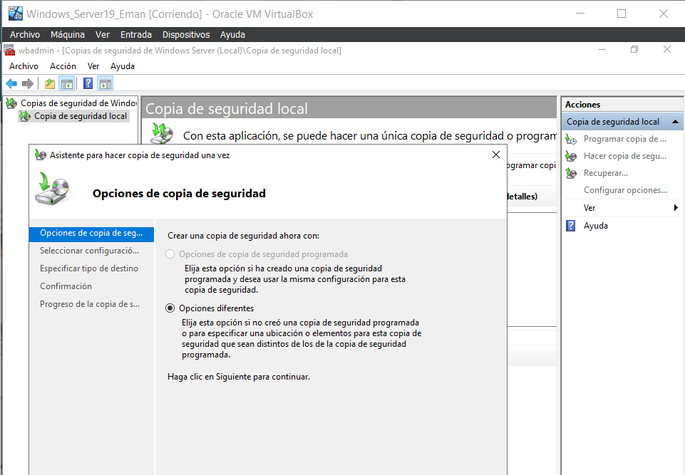
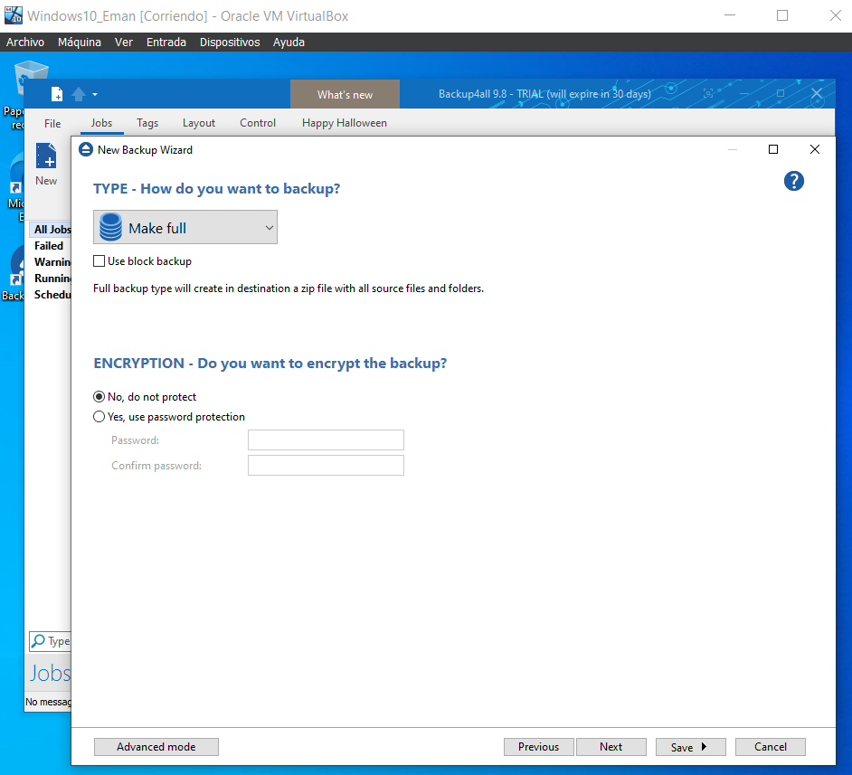
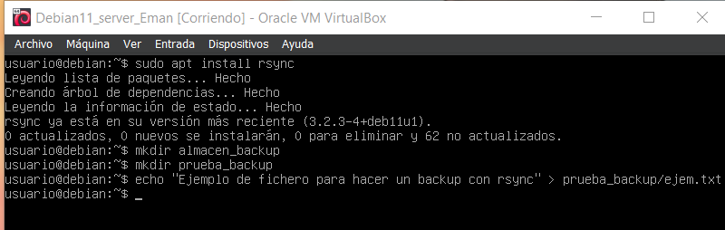
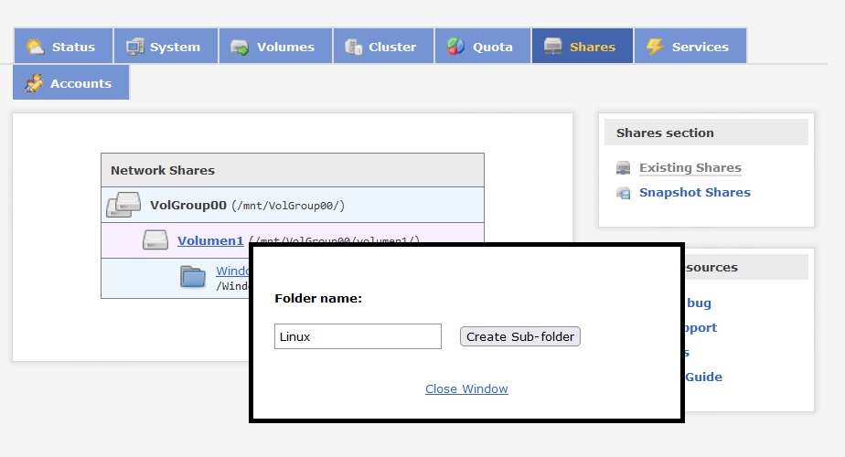
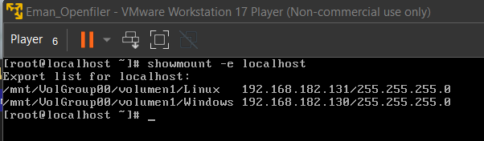

# Actividades Seguridad Pasiva

## Actividad 1.- Búsqueda de Información
Búsqueda de información con el fin de elaborar un diccionario de herramientas mencionadas en este tema, y de aquellos que resulten de la búsqueda de información, en el que se describen los siguientes elementos: descripción, http de descarga y http de tutorial/manual de uso, http de ejemplo de aplicación/uso, otros aspectos.

 

### RAID (Redundant Array of Independent Disks)
Consiste en un conjunto de técnicas hardware o software que utilizando varios discos proporcionan principalmente tolerancia a fallos, mayor capacidad y mayor fiabilidad en el almacenamiento. Se trata de un sistema de almacenamiento que utilizando varios discos y distribuyendo o replicando la información entre ellos.

Son técnicas que ya van implementadas en los sistemas operativos, solo hace falta llevarlo a cabo

Manual de uso para Linux: https://docs.aws.amazon.com/es_es/AWSEC2/latest/UserGuide/raid-config.html

Manual de uso para Windows: https://docs.aws.amazon.com/es_es/AWSEC2/latest/WindowsGuide/raid-config.html

 

### Backup4all
Nos permite proteger los datos de las posibles pérdidas parciales o totales, automatiza el proceso de realización de copias de seguridad y permite, entre otras funciones, comprimir y cifrar las copias de seguridad.

Descarga: https://www.backup4all.com/download.html

Manual/Tutorial: https://download.backup4all.com/download/pdf/Backup4all-User-Manual.pdf

 

### Cobian Backup
Cobian Backup es un programa gratuito, multitarea, capaz de realizar copias de seguridad en un equipo, unidad extraíble, red local o incluso en/desde un servidor FTP. Soporta conexiones seguras mediante SSL. Se ejecuta sobre windows y uno de sus grandes fuertes es que consume muy pocos recursos y puede estar funcionando en segundo plano.

Descarga: https://www.cobiansoft.com/cobianbackup.html

Manual/Tutorial: https://youtu.be/LELZdOcpkU4

 

### Amanda
Orientada a crear copias de seguridad en múltiples terminales bajo la dirección del administrador de la red. El proceso se lleva a cabo gracias a un servidor que engloba a los terminales seleccionados y realiza un backup rápido y cómodo, ya que evita andar clonando disco por disco.

Descarga: https://www.amanda.org/download.php

Documentación para usuarios: https://wiki.zmanda.com/index.php/User_documentation

Documentación para desarrolladores: https://wiki.zmanda.com/index.php/Developer_documentation

 

### Burt
Burt es un sistema de copias de seguridad de redes creado en la universidad de Wisconsin. Está diseñado para hacer copias de seguridad de grandes redes heterogéneas. Usa el lenguaje de encriptado TCL y herramientas de copia de seguridad estándar como dump y GNUTar para permitir copias de seguridad de una amplia variedad de orígenes de datos, incluyendo estaciones de trabajo UNIX y Windows NT, almacenamientos basados en AFS y otros. 

Descarga: https://pages.cs.wisc.edu/~jmelski/burt/download.html

Pasos de instalación: https://pages.cs.wisc.edu/~jmelski/burt/install.html

Manual/Tutorial: https://pages.cs.wisc.edu/~jmelski/burt/docs.html

 

### BRU
BRU Server es una herramienta de copias de seguridad en red diseñada por TOLIS Group que proporciona la posibilidad de hacer y restaurar copias de seguridad de clientes y servidores en redes de cualquier tamaño. Soporta todos los principales sistemas operativos cliente así como sistemas operativos servidor.

Descarga: https://www.tolisgroup.com/demos62051.html

Manual/Tutorial: https://www.tolisgroup.com/assets/argest_backup_user_guide.pdf

 

### Arkeia
Arkeia Software es un software de copia de seguridad y almacenamiento en red network para Windows, Macintosh, Linux, AIX, BSD y HP-UX.

Descarga: https://support.wdc.com/arkeia/software.aspx

Manual/Tutorial: https://docplayer.net/11888179-Arkeia-network-backup-user-manual.html

 

### Mondo
Mondo Rescue es un software de recuperación en caso de desastre. Soporta Linux (i386, x86-64, IA-64) y FreeBSD (i386). Está empaquetado para múltiples distribuciones (Red Hat, RHEL, Fedora, CentOS, OpenSuSE, SLES, Mandriva, Debian, Ubuntu, Gentoo). También soporta cintas, discos, dispositivos USB, redes y CD/DVD como medios para copia de seguridad, múltiples sistemas de ficheros, LVM, software y RAID por software y hardware.

Descarga: http://www.mondorescue.org/downloads.shtml

Manual/Tutorial: http://www.mondorescue.org/docs/mondorescue-howto.pdf

 

### dump
La herramienta se encarga de examinar los archivos y sistemas de ficheros ext2 y ext3 y determina qué archivos deben copiarse. Estos se pueden almacenar en el propio disco del sistema o bien en otro medio externo, ya sea un recurso compartido en red o bien una unidad de cinta. Un volcado que es más grande que el medio de salida, se divide en varios volúmenes. Se puede indicar el tamaño de cada volumen también de manera manual mediante parámetros.

Herramienta básica que ya trae instalado el sistema operativo.

Manual/Tutorial: https://help.highbond.com/helpdocs/analytics/13/scripting-guide/es/Content/lang_ref/commands/r_dump.htm

 

### restore
Recupera un archivo de copia de seguridad y lo restaura en una CIU o en un appliance virtual o físico independiente.

Herramienta básica que ya trae instalado el sistema operativo.

Manual/Tutorial: https://techdocs.broadcom.com/es/es/symantec-security-software/endpoint-security-and-management/endpoint-detection-and-response/4-8/using-the-command-line-interface-v109281349-d38e71236/restore-command-v117597616-d38e72430.html

 

### tar
Tar es una herramienta básica de Linux más usada para comprimir archivos. Tar significa Tape Archive (archivo de cinta) y se utiliza para comprimir una colección de archivos y carpetas.

Herramienta básica que ya trae instalado el sistema operativo.

Manual/Tutorial: https://www.hostinger.es/tutoriales/como-usar-comando-tar-linux

 

### cpio
Es una utilidad que permite copiar archivos a o desde un contenedor cpio, que no es más que un fichero que almacena otros archivos e información sobre ellos (permisos, nombres, propietario...). Este contenedor puede ser un disco, otro archivo, una cinta o incluso una tubería, mientras que los ficheros a copiar pueden ser archivos normales, pero también dispositivos o sistemas de ficheros completos.

Herramienta básica que ya trae instalado el sistema operativo.

Manual/Tutorial: https://www.ibiblio.org/pub/linux/docs/LuCaS/Manuales-LuCAS/doc-unixsec/unixsec-html/node106.html

 

### dd
El comando dd (Dataset Definition), es una herramienta sencilla, útil, y sorprendentemente fácil de usar; con esta herramienta se puede hacer lo mismo, sobre dispositivos: discos y particiones, que con programas comerciales con solo una pequeña línea de comandos.

Herramienta básica que ya trae instalado el sistema operativo.

Manual/Tutorial: https://blog.desdelinux.net/uso-del-comando-dd/

 

### rsync
rsync es la herramienta de copiado y sincronización de archivos más potente que existe en el mundo de Linux/Unix. Es una utilería, que de acuerdo a su página, es rápida, versátil para el copiado local y remoto de archivos. Ofrece una larga lista de opciones que controlan todos los posibles aspectos de su comportamiento.

Herramienta básica que ya trae instalado el sistema operativo.

Manual/Tutorial: https://www.linuxtotal.com.mx/index.php?cont=rsync-manual-de-uso

 

### duplicity
Descripción:Duplicity es un programa de copias de seguridad en red. Puede guardar instantáneas de directorios y archivos en un archivo tar remoto encriptado con GnuPG, que actúa como repositorio de copias de seguridad. La conexión con el repositorio remoto puede realizarse a través de cualquiera de los siguientes protocolos: rsync, ftp, HSI, WebDAV, Tahoe-LAFS, o Amazon S3.

Descarga:

    apt-get install duplicity

Manual/Tutorial: https://duplicity.nongnu.org/vers7/duplicity.1.html

 

### cron
Cron es un administrador de tareas de Linux que permite ejecutar comandos en un momento determinado, por ejemplo, cada minuto, día, semana o mes. Si queremos trabajar con cron, podemos hacerlo a través del comando crontab.

Herramienta básica que ya trae instalado el sistema operativo.

Manual/Tutorial: https://www.linuxtotal.com.mx/index.php?cont=info_admon_006

 

### Recuva
Recuva es un programa que te permite recuperar información desde tu PC o dispositivos de almacenamiento externos como tarjetas SD o discos duros en caso de que hayas perdido tus archivos al eliminarlos por error, al recibir un ataque de un virus o al dañarse tu información.

Descarga: https://www.ccleaner.com/es-es/recuva/download

Manual/Tutorial: https://4ddig.tenorshare.com/es/computer-data-recovery/how-to-use-recuva.html

 

### TestDisk
TestDisk es un software gratuito de recuperación de datos. Fue principalmente diseñado para ayudar a recuperar particiones perdidas y/o volver discos no booteables a booteables nuevamente cuando estos síntomas son causados por software con fallas, ciertos tipos de virus o error humano.

Descarga:https://www.cgsecurity.org/wiki/TestDisk_Download

Manual/Tutorial: https://www.cgsecurity.org/testdisk_doc/

 

### Foremost
Foremost es una herramienta forense para la recuperación de ficheros basado en sus cabeceras, footer y estructuras de datos internas. Foremost puede trabajar con imágenes, como las generadas por dd, Safeback, Encase, etc, o directamente sobre un disco.

Descarga: https://foremost.sourceforge.net/

Manual/Tutorial: https://foremost.sourceforge.net/foremost.html

 

### PhotoRec
PhotoRec es un software diseñado para recuperar archivos perdidos incluyendo videos, documentos y archivos de los discos duros y CDRoms así como imágenes perdidas (por eso el nombre PhotoRecovery) de las memorias de las cámaras fotográficas, MP3 players, PenDrives, etc. PhotoRec ignora el sistema de archivos y hace una búsqueda profunda de los datos.

Descarga: https://photorec.programas-gratis.net/

Manual/Tutorial: https://www.cgsecurity.org/testdisk_doc/

 

### Scalpel
Scalpel es un fork actualizado de foremost, aunque más rápida y más eficiente en el rastreo y búsqueda de patrones de archivos que utiliza una base de datos que almacena patrones de bytes conocidos de archivos e identifica los archivos borrados y recuperar los recupera de manera instantánea.

Descarga: https://pkgs.org/download/scalpel

Manual/Tutorial: https://www.redhat.com/sysadmin/find-lost-files-scalpel

 

### Symantec Ghost
Symantec Ghost Solution Suite es una solución de software galardonada que crea imágenes y se implementa en computadoras de escritorio, computadoras portátiles, tabletas y servidores.

Descarga: https://knowledge.broadcom.com/external/article/175846/download-the-latest-version-of-symantec.html

Manual/Tutorial: https://techdocs.broadcom.com/content/dam/broadcom/techdocs/symantec-security-software/endpoint-security-and-management/ghost-solutions-suite/generated-pdfs/GSS_3_3_User_Guide.pdf

 

### Acronis True Image
Acronis True Image es un programa que sirve para la clonación de equipos informáticos tanto del disco duro al completo (imágenes de disco) como de una o varias particiones. Además, permite crear copias de seguridad de carpetas y ficheros.

Descarga: https://kb.acronis.com/content/65523#

Manual/Tutorial: https://www.acronis.com/en-us/support/documentation/ATI2021/#35899.html

 

## Actividad 2.
Analiza y describe los sistemas biométricos que actualmente se están utilizando, así como los estudios de implantación de nuevas tecnologías respecto a este campo.

La biometría es el método de reconocer a las personas basado en sus características físicas, lógicas o de comportamiento. En la actualidad, la tecnología ha permitido perfeccionar los procesos de reconocimiento biométricos, de forma que tienen uso en multitud de aplicaciones y finalidades.

Hoy en día las tecnologías de biometría más usadas son la huella dactilar y el reconocimiento facial debido a que en los dispositivos móviles son las más comunes.

- Huella dactilar: 
Es la más antigua y sigue en uso debido a su alta tasa de precisión y su facilidad de uso. Funciona de dos formas:

  - Basadas en minucias: 
Esta técnica se basa en identificar las partes más fácilmente detectables existentes en la huella dactilar. Se guarda la forma y la posición dentro de la huella y tras una serie de cálculos permite el acceso. Sin embargo existen algunas dificultades asociadas a este método, porque si la calidad no es muy buena, es difícil extraerlas de forma precisa.

  - Basadas en correlación: 
Mediante este método se analiza el patrón entero y se genera un esquema. Esta técnica requiere un registro preciso. pero su principal problema es que se ve afectada por la rotación de la imagen.

- Reconocimiento facial: 
El reconocimiento facial es la técnica por la cual se reconoce a una persona a partir de una imagen de la cara. Entre los aspectos claves se encuentra la simetría facial, la longitud de la nariz o el ángulo de la mandíbula. A diferencia de otros sistemas biométricos este sistema se puede usar para la vigilancia en general, habitualmente es usado en cámaras de vídeo.

- Reconocimiento de iris: 
Esta técnica está aún en desarrollo y que poco a poco está tomando más importancia además es más difícil de vulnerar debido a que tiene más de 200 propiedades únicas. El escaneado del iris se lleva a cabo con una máquina infrarrojos especializada y muy cerca de la persona, ilumina el ojo y le hace una fotografía de alta resolución.

## Actividad 3
Analiza el asistente/herramienta de copias de seguridad con el programador de tareas, restauración de las copias de seguridad, puntos de restauración, disco de reparación y reinicio del sistema en reparación/restauración en un entorno Windows 10 o windows server. Realiza el ejemplo pertinente que demuestre la utilización de herramienta.

Las copias de seguridad en un Windows Server 19 son una característica, no un rol, que hay que implementar al servidor porque de base no están implementadas.

Después podremos hacer la copia de seguridad en “Herramientas -> Copias de seguridad de Windows Server -> Copia de seguridad local”, aquí hay varias opciones a la derecha, puedes, programar, hacer una ahora o recuperar una copia de seguridad.

Programar una copia de seguridad: Le damos en la opción de programar una copia de seguridad y seguimos el asistente, primero nos saldrá una introducción de que vamos a programar una copia de seguridad.

Después de la introducción te pregunta a que le quieres hacer la copia de seguridad, en este caso yo se la voy a hacer a todo el servidor, pero se le puede hacer a ficheros o archivos concretos.

En el siguiente paso puedes especificar la hora de la copia de seguridad y si quieres hacerla mas de una vez al día, en este caso lo pondré por defecto que es cada día a las 22:00.

Aquí se especificará dónde se almacenarán las copias de seguridad que se hagan, puede ser un disco duro dedicado, en un volumen o en una carpeta compartida en la red, yo lo dejaré en un disco duro nuevo que le habré asignado previamente a la máquina virtual y formateado con el Administrador de discos.

En el siguiente seleccionaremos el disco donde queramos guardar la copia de seguridad, en mi caso el único que aparece.

El siguiente paso es la confirmación de querer hacer la programación de la copia de seguridad con un resúmen de todo lo que hemos especificado antes.El siguiente paso es la confirmación de querer hacer la programación de la copia de seguridad con un resúmen de todo lo que hemos especificado antes.

Lo último es la confirmación de la correcta creación de esta programación de la copia de seguridad.

Hacer una copia de seguridad al momento: Le damos a la opción y seguimos el asistente,el primer paso que nos da es la opción de permitir la modificación de una copia de seguridad programada, pero en este caso como queremos hacer una en el momento le damos a Opciones diferentes.

Igual que con la copia de seguridad programada te preguntará si quieres hacerlo de un servidor completo o de un fichero o archivo en concreto, también te preguntará donde quieres que se guarde la copia de seguridad y su destino.

Lo último sería lo confirmación igual que antes con un resumen de las configuraciones que hemos hecho antes, una vez aceptado empezará a crearse una copia de seguridad, cosa que tardará un rato en hacer, pero despues si te vas al destino que has elegido para la copia de seguridad te saldra una carpeta con toda la copia hecha.

Recuperar una copia de seguridad: en este caso usaremos la copia de seguridad que hemos hecho antes para restaurarla en nuestro sistema, para ver su funcionamiento, lo primero que te pregunta es donde se encuentra ubicada la copia de seguridad a restaurar, en este caso está en el propio servidor.

Aquí te preguntará la fecha en la que se hizo la copia de seguridad, como es la única copia de seguridad que hemos hecho la reconocerá fácilmente.

Te preguntará que quieres recuperar de esa copia de seguridad, en este caso lo dejamos archivos y carpetas para tener una restauración del servidor completa.

Dentro de la copia de seguridad puedes seleccionar que quieres restaurar, dentro de las carpetas y archivos que hay, en mi caso seleccioné Disco local (C:).

Lo siguiente es la confirmación de la restauración con el resumen de todo lo que se ha seleccionado anteriormente.

Una vez empezada la restauración podremos ver una barra de progreso que una vez completa indicará la correcta restauración de los archivos o carpetas seleccionadas.

 

## Actividad 4. 
Analiza, configura y prueba la herramienta de copia de seguridad Cobian Backup.

Cobian Backup se compone de dos partes. El servicio y la aplicación con la interfaz de usuario por lo que primero hay que iniciar el servicio y luego la aplicación.

Tras iniciar la aplicación iniciamos una tarea

Para que no de problemas de seguridad aunque no es aconsejable quitamos el protocolo ssl

Luego le daremos a ejecutar y deberá de salirnos una una parntalla tal que así

 

## Actividad 5.
Analiza, configura y prueba la herramienta de copia de seguridad Backup4all.

Para usar el Backup4all necesitaremos descargarlo e instalarlo.

Una vez instalado y lo abrimos nos saldrá una pantalla donde podremos seleccionar hacer un nuevo backup, si lo seleccionamos nos saldrá la siguiente pantalla, donde seleccionaremos donde queremos que se nos guarde la copia de seguridad en mi caso he asignado un nuevo volumen a la máquina Windows donde guardará la copia de seguridad y le damos a Next.

En la siguiente pantalla te preguntará a qué le quieres hacer el backup, en mi caso se lo haré al volúmen C: al completo.

Aquí puedes filtrar a que le quieres hacer backup y a que no, yo lo dejare por defecto con todo seleccionado.

En este apartado te saldrán dos cosas distintas:
- El tipo de copia que quieres hacer, en mi caso una completa aunque puedes elegir incremental si ya tienes la completa y solo quieres actualizar los cambios.
- Si quieres encriptar la copia de seguridad para más seguridad.

En este apartado puedes programar lahora a la que hacer la copia de seguridad, pero en este caso la haré manualmente y despues te pregunta si quieres recibir correos electrónicos con notificaciones sobre la copia de seguridad.

Lo ultimo que te pedirá es un nombre y opcionalmente ponerle una descripción además de poner un icono.

Una vez empezada la copia de seguridad saldrá una barra de progreso que indica lo que falta para completar la copia de seguridad.

Una vez hecha la copia de seguridad se verá así.

Esta misma copia de seguridad puedes testear para ver si no te da problemas antes de restaurar su contenido.

Una vez testeado podremos restaurar la copia de seguridad sin problemas, si le damos la primera pantalla será sobre donde queremos restaurar la copia de seguridad en mi caso lo voy a dejar por defecto que es en la ubicación original y ya depende de si le has hecho versiones a la copia de seguridad podrás decidir qué versión recuperar, en mi caso como solo he hecho una la dejaré en la última.

Y ya podremos ver la barra de progreso de la restauración.

Luego en el historial del backup podemos ver que la restauración ha sido exitosa.

 

## Actividad 6
Configura y automatiza la copia de seguridad en un entorno linux de una estructura de directorios. Utiliza para ello el comando tar y el servicio crond consideramos que la copia se realiza en el mismo equipo.

Generamos este script y lo metemos dento de /etc/cron.daily o lo metemos dentro del contab y le ponemos cada cuanto queremos que se ejecute

 

## Actividad 7
Configura y automatiza la copia de seguridad en un entorno linux de una estructura de directorios, considerando que la copia se realiza en otro equipo linux/windows (host remote).

Para hacer esta práctica haré uso de la herramienta duplicity, para ello tendre que instalarla con apt install duplicity.

En este caso en vez de hacer un backup de todo lo que haré es un backup de un directorio con fichero, para hacerlo usaré el comando:

    duplicity *ruta_para_buckup* scp://*usuario*:*contraseña*@*ip_cliente*//*ruta donde guardar el backup*

Una vez ejecutado te encriptar la copia de seguridad para que nadie pueda acceder a ella, si nos vamos al cliente veremos que hay tres ficheros .gpg que son el backup.

Para comprobar el backup eliminaremos el fichero y directorio de la máquina servidora y despues usaremos el comando:

    duplicity scp://*usuario*:*contraseña*@*ip_cliente*//*ruta donde guardar el backup* *ruta_para_buckup*

Tendrá un proceso de recuperación y una vez recuperado, podremos listar el directorio de nuevo y ver el contenido del fichero.

 

## Actividad 9.
Analizar, implementar y configurar en un entorno linux la herramienta rsync.

Para llegar a usar la herramienta rsync tendremos que instalarla.

    apt install rsync

Usaremos el mismo directorio y fichero que en la actividad 7 y lo que haremos será crear un nuevo directorio que llamaremos almacen_backup y usaremos el comando:

    rsync -av prueba_backup almacen_buckup 

Para indicar que añadiremos el directorio prueba_backup a la copia de seguridad incremental que se guarda en almacen_backup, y podremos hacer el mismo proceso varias veces, ya que es una copia de seguridad incremental se van guardando los cambios sin tocar el resto de directorios o archivos para ejecutar esa copia de seguridad le añadimos la opción de –dry-run.

Y ya podemos hacer un listado al directorio y una lectura a los ficheros que tiene el almacén del backup, nos daremos cuenta que se han guardado pero los ficheros también están en el directorio original.

 

## Actividad 11.
Amazon S3 se integra de forma nativa con AWS Backup, un servicio completamente administrado basado en políticas que puede utilizar para definir de forma central políticas de copia de seguridad para proteger los datos de Amazon S3. Después de definir las políticas de copia de seguridad y asignar recursos de Amazon S3 a las políticas, AWS Backup automatiza la creación de copias de seguridad de Amazon S3 y almacena de forma segura las copias de seguridad en un almacén de copias de seguridad cifrado que haya designado en su plan de copia de seguridad.

Al utilizar AWS Backup para Amazon S3, puede realizar las siguientes acciones:

- Crear copias de seguridad continuas y copias de seguridad periódicas. Las copias de seguridad continuas son útiles para realizar una restauración en un punto del tiempo y las copias de seguridad periódicas son útiles para satisfacer sus necesidades de retención de datos a largo plazo.

- Automatizar la programación y la retención de copias de seguridad mediante la configuración centralizada de las políticas de copia de seguridad.

- Restaurar copias de seguridad de los datos de Amazon S3 en el punto del tiempo que especifique.

Con AWS Backup, puede crear los siguientes tipos de copias de seguridad de sus buckets de S3, incluidos datos de objetos, etiquetas, listas de control de acceso (ACL) y metadatos definidos por el usuario:

- Las copias de seguridad continuas le permiten realizar una restauración a cualquier momento de los últimos 35 días. Las copias de seguridad continuas de un bucket de S3 solo deben configurarse en un plan de copia de seguridad.

- Las copias de seguridad periódicas utilizan instantáneas de sus datos para que pueda retenerlos durante un periodo especificado de hasta 99 años. Puede programar copias de seguridad periódicas en frecuencias de 1 hora, 12 horas, 1 día, 1 semana o 1 mes. AWS Backup realiza copias de seguridad periódicas durante el intervalo de copia de seguridad que defina en su plan de copia de seguridad.

AWS Backup le permite hacer copias de seguridad de los datos de S3 almacenados en las siguientes clases de almacenamiento de S3:

- S3 Standard

- S3 Standard-Infrequent Access ()

- S3 One Zone-IA

- S3 Glacier Instant Retrieval

- S3 Intelligent-Tiering (S3 INT)

Puedes hacer backup de una amplia variedad de recursos y servicios. Algunos de los recursos y servicios comunes que puedes respaldar en AWS incluyen:

- Versiones de objetos: Puedes habilitar la característica de versionado en un bucket de S3. Esto te permitirá mantener múltiples versiones de un objeto en el mismo bucket. Cuando realices cambios en un objeto, en lugar de sobrescribirlo, S3 guardará una nueva versión. Esto te permite recuperar versiones anteriores si es necesario.

- Copia de seguridad programada: Puedes automatizar la copia de seguridad de tus datos en S3 utilizando scripts o servicios de AWS como AWS DataSync, AWS Data Pipeline o AWS Lambda. Puedes programar estos procesos para que se ejecuten a intervalos regulares y respalden datos específicos en S3.

- Copia de seguridad de bases de datos y aplicaciones: Si tienes aplicaciones o bases de datos en AWS que almacenan datos en S3, puedes configurar tus aplicaciones para realizar copias de seguridad regulares en S3. Esto puede incluir copias de seguridad de registros, archivos de configuración y otros datos importantes.

- Políticas de ciclo de vida: Puedes definir políticas de ciclo de vida en tu bucket de S3 para automatizar la transición de objetos a clases de almacenamiento más económicas, como S3 Glacier, después de un período de tiempo específico. Esto puede ayudarte a reducir costos y garantizar la retención a largo plazo de datos importantes.

- Copia de seguridad de sitios web estáticos: Si alojas un sitio web estático en S3, puedes mantener copias de seguridad regulares de los archivos HTML, CSS, JavaScript, y otros recursos del sitio en el mismo bucket o en otro bucket de S3.

 

## Actividad 12

Configura y automatiza la copia de seguridad en un entorno linux de una estructura de directorios. Utiliza para ello el comando duplicity y el servicio crond – consideramos que la copia se realiza en el mismo equipo-.

Para eso debemos hacer un crontab -e y ejecutarlo como nano 

Despues debemos meterlo de esta manera

 

## Actividad 14
Explica y ejercita las opciones más importantes de la herramienta de clonación Clonezilla. Considera que la clonación se realiza en el mismo equipo. Realiza la restauración con el fin de comprobar el proceso realizado. 

Para realizar esto debemos instalar la iso en un disco duro. Tras su intalación e inicialización debemos de escoger un disco en el que se creará la imagen

Luego debemos guardar la imagen en el disco local 

Luego se copiara 

Como vemos se podrá restaurar todo el primer disco
 

## Actividad 21
Instalación y puesta en marcha de un sistema de almacenamiento compartido NAS. Utilizar Openfiler.

Para configurar un servidor NAS con Openfiler tendremos que acceder a su pagina web en el navegador con su ip y el puerto 446, iniciaremos sesion con el usuario openfiler y contraseña password

Lo primero que voy a hacer es cambiarle la contraseña por defecto de password en el apartado Accounts

Para indicar la forma a la que accederan los clientes para guardar sus ficheros en nuestro servidor NAS nos tenemos que ir a la pestaña Services y ahí seleccionamos un servicio de compartir carpetas, en mi caso he seleccionado NFS Server como servicio, le damos a Enable y Start

Ahora tendremos que darle acceso al servidor a la ip o el rango de ips que queramos, ene ste caso yo dejaré que cualquiera que este dentro de la red 192.168.0.0 y con máscara 255.255.0.0 pueda acceder al servidor NAS para guardar los archivos

En este caso tenemos un volumen físico que será donde se guarden los archivos, el volumen es el resto de espacio libre que tiene el disco, esto lo configuramos de forma sencilla en el proceso de instalación creando tambien un grupo de voluemens, ene ste partado del grupo de volumenes creamos un volumen llamado Volumen1

Ahora nos vamos a la pestaña shares donde podremos sobre el Volumen crear directorios, crearé  dos directorios, uno llamado Linux y otro Windows donde estarán los clientes 

Luego si pinchamos en un directorio podremos darla a Make Share para compartirlo

Se nos abirra esta parte donde en Share Acces Control Mode le tenemos que habilitar el acceso público y le damos a Update

En la misma ventana si bajamos se nos enseñará la configuración del host y veremos que en el apartado NFS esta en No, eso lo cambiamos a RO en mi caso, para que solo puedan leer pero para leer y escribir seleccionamos RW luego le damos a Update

Si en la maquina ponemos el comando:

    showmount -e localhost

Podremos ver los dos directorios creados y donde estan montados

(No pude hacer los clientes porque me estaban dando problemas el adaptador puente tanto en VMware como Virtualbox)

## Actividad 22

Instalación y puesta en marcha de un sistema de almacenamiento compartido SAN. Utilizar Openfiler.

Para hacer esto debemos iniciar el servicio SCSI Target en un volumen y tras iniciar este servicio ya lo deberíamos tener tras ponerle los permisos que debemos para conectarnos con el volumen

Luego en las maquinas debemos habiliter el protocolo SCSI y conectarnos al volumen con la dirección que nos da como SCSI server

##

##

##

##

